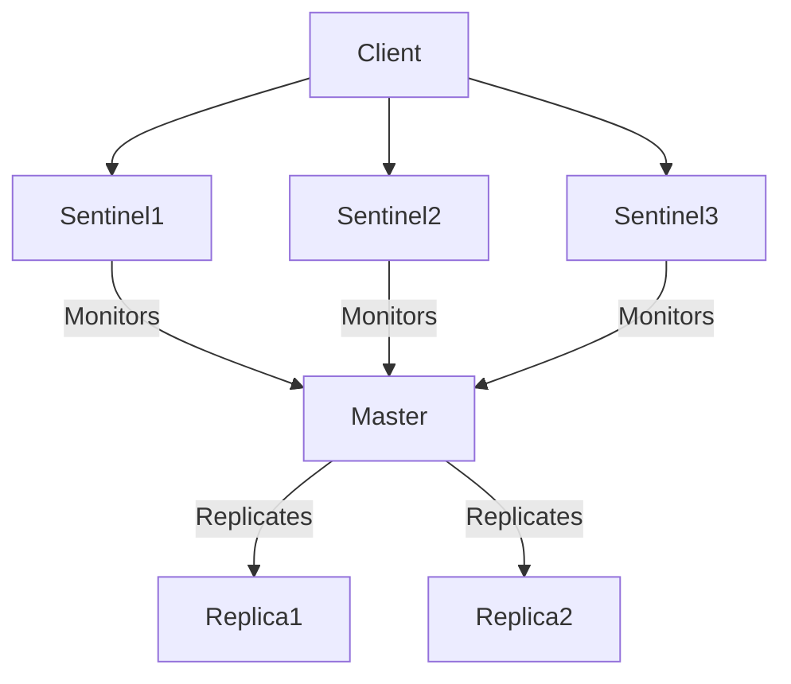
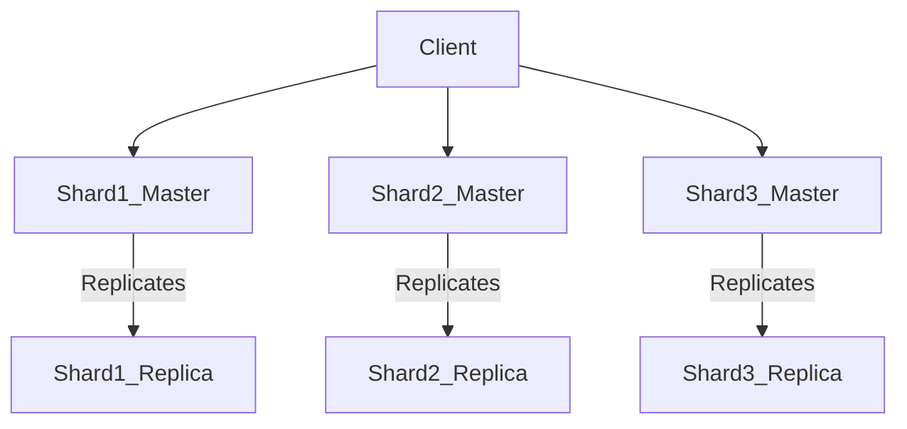

# Redis Data Types and Operations Guide

## Table of Contents
1. [Redis Data Types Summary](#redis-data-types-summary)
2. [Core Data Types](#core-data-types)
   - [Strings](#1-strings)
   - [Lists](#2-lists)
   - [Sets](#3-sets)
   - [Sorted Sets (ZSets)](#4-sorted-sets-zsets)
   - [Hashes](#5-hashes)
3. [Advanced Data Types](#advanced-data-types)
   - [Bitmaps](#6-bitmaps)
   - [HyperLogLog](#7-hyperloglog)
   - [Streams](#8-streams)
   - [Geospatial](#9-geospatial)
4. [Redis vs Traditional Database](#3-how-does-redis-differ-from-a-traditional-database)
5. [TTL (Time To Live)](#4-what-is-ttl-in-redis)
6. [Data Persistence](#5-how-to-persist-data-in-redis)
7. [Pub/Sub](#6-what-is-redis-pubsub)
8. [Concurrency](#7-how-does-redis-handle-concurrency)
9. [Pipelines](#8-what-is-a-redis-pipeline)
10. [Transactions](#9-what-is-a-redis-transaction)
11. [Sentinel vs Cluster](#10-what-is-the-difference-between-redis-sentinel-and-cluster)
12. [Data Durability](#15-how-does-redis-ensure-data-durability)

## Redis Data Types Summary
A quick reference guide to Redis data structures with Node.js examples.

## Core Data Types

### 1. Strings
* Basic key-value storage for text, numbers, or binary data (up to 512MB)
* Operations: SET, GET, INCR, SETEX
* Use cases: Counters, session data, caching

```javascript
await client.set('username', 'john_doe');
await client.incr('counter'); // Increment counter
const value = await client.get('username'); // 'john_doe'
```

### 2. Lists
* Ordered collections of strings with head/tail insertion
* Operations: LPUSH, RPUSH, LPOP, LRANGE
* Use cases: Queues, stacks, activity feeds

```javascript
await client.lPush('tasks', 'task1', 'task2');
const tasks = await client.lRange('tasks', 0, -1); // Get all
const first = await client.lPop('tasks'); // Remove first
```

### 3. Sets
* Unordered collections of unique strings
* Operations: SADD, SMEMBERS, SISMEMBER, SREM
* Use cases: Tags, unique visitors, relationships

```javascript
await client.sAdd('tags', 'redis', 'database', 'nosql');
const allTags = await client.sMembers('tags');
const exists = await client.sIsMember('tags', 'redis'); // true
```

### 4. Sorted Sets (ZSets)
* Sets with scored members for automatic ordering
* Operations: ZADD, ZRANGE, ZREVRANGE, ZRANK
* Use cases: Leaderboards, priority queues, time-series data

```javascript
await client.zAdd('leaderboard', [
  { score: 100, value: 'player1' },
  { score: 200, value: 'player2' }
]);
const top = await client.zRevRange('leaderboard', 0, 2); // Highest scores
```

### 5. Hashes
* Field-value maps representing objects
* Operations: HSET, HGET, HGETALL, HINCRBY
* Use cases: User profiles, configuration, object storage

```javascript
await client.hSet('user:1000', { name: 'Alice', age: '30' });
const user = await client.hGetAll('user:1000');
const name = await client.hGet('user:1000', 'name'); // 'Alice'
```

## Advanced Data Types

### 6. Bitmaps
* Bit-level operations on strings
* Operations: SETBIT, GETBIT, BITCOUNT
* Use cases: User activity tracking, feature flags

```javascript
await client.setBit('daily_active', 100, 1); // User 100 active
const isActive = await client.getBit('daily_active', 100); // 1
const activeCount = await client.bitCount('daily_active'); // Total active
```

### 7. HyperLogLog
* Probabilistic unique item counting with minimal memory
* Operations: PFADD, PFCOUNT
* Use cases: Unique visitor counting, cardinality estimation

```javascript
await client.pfAdd('visitors', 'user1', 'user2', 'user1'); // Duplicates ignored
const uniqueCount = await client.pfCount('visitors'); // ~2
```

### 8. Streams
* Append-only log structure for event sourcing
* Operations: XADD, XREAD
* Use cases: Message queues, event logs, real-time analytics

```javascript
await client.xAdd('events', '*', { type: 'login', user: '1000' });
const entries = await client.xRead({ key: 'events', id: '0' });
```

### 9. Geospatial
* Geographic coordinate storage and queries
* Operations: GEOADD, GEODIST, GEORADIUS
* Use cases: Location-based services, proximity searches

```javascript
await client.geoAdd('cities', { longitude: -74.0059, latitude: 40.7128, member: 'NYC' });
const distance = await client.geoDist('cities', 'NYC', 'LA', 'mi');
```

## 3. How does Redis differ from a traditional database?
Redis stores data in-memory, making it much faster than disk-based databases.

## 4. What is TTL in Redis?
TTL (Time To Live) defines how long a key should live before being deleted. You can set it using EXPIRE, SET key value EX 10, or PEXPIRE.

## 5. How to persist data in Redis?
Redis supports two persistence mechanisms:
* RDB (Snapshotting): Saves data at intervals.
* AOF (Append Only File): Logs every write operation. More durable but slower.

## 6. What is Redis Pub/Sub?
Pub/Sub allows publishers to send messages to channels and subscribers to receive them in real-time.

### Basic Publisher
```javascript
import { createClient } from 'redis';

const publisher = createClient();
await publisher.connect();

// Publish to a channel
await publisher.publish('news', 'Breaking news: Redis 7 released!');
await publisher.publish('sports', 'Lakers win the championship!');

// Pattern publishing (using Redis 7+)
await publisher.publish('logs:system', 'System rebooted');
await publisher.publish('logs:app', 'New user registered');
```

### Basic Subscriber
```javascript
// Subscribe to specific channels
await subscriber.subscribe('news', (message, channel) => {
  console.log(`[${channel}] ${message}`);
});

await subscriber.subscribe('sports', (message, channel) => {
  console.log(`[${channel}] ${message}`);
});

// Pattern subscription (using Redis 7+)
await subscriber.pSubscribe('logs:*', (message, channel) => {
  console.log(`[PATTERN ${channel}] ${message}`);
});
```

## 7. How does Redis handle concurrency?
Redis is single-threaded and handles commands sequentially using an event loop. This simplifies concurrency management and ensures atomic operations.

## 8. What is a Redis pipeline?
Pipelining allows multiple commands to be sent in one go without waiting for individual responses, reducing network round-trips and improving throughput.

```javascript
const client = createClient({ url: 'redis://:@localhost:6379' });
await client.connect();

// Create pipeline
const pipeline = client.multi();

// Queue commands
pipeline.set('pipeline:key1', 'value1');
pipeline.get('pipeline:key2');
pipeline.incr('pipeline:counter');

// Execute all commands
const results = await pipeline.exec();
console.log(results); // ['OK', 'value2', 43]
```

## 9. What is a Redis transaction?
Execute multiple commands as a single atomic operation 

```javascript
const client = createClient();
await client.connect();

// Start transaction
const transaction = client.multi();

// Queue commands
transaction.set('tx:key1', 'value1');
transaction.incr('tx:counter');
transaction.hSet('tx:user', { name: 'Alice', score: 100 });

// Execute
const results = await transaction.exec();
console.log(results); // ['OK', 42, 1]
```

## 10. What is the difference between Redis Sentinel and Cluster?
Sentinel: Manages master-slave failover and monitoring.



Cluster: Adds data sharding and distributed scaling.



## 15. How does Redis ensure data durability?
Redis ensures data durability through two primary mechanisms: RDB snapshots and AOF (Append-Only File) logging.
